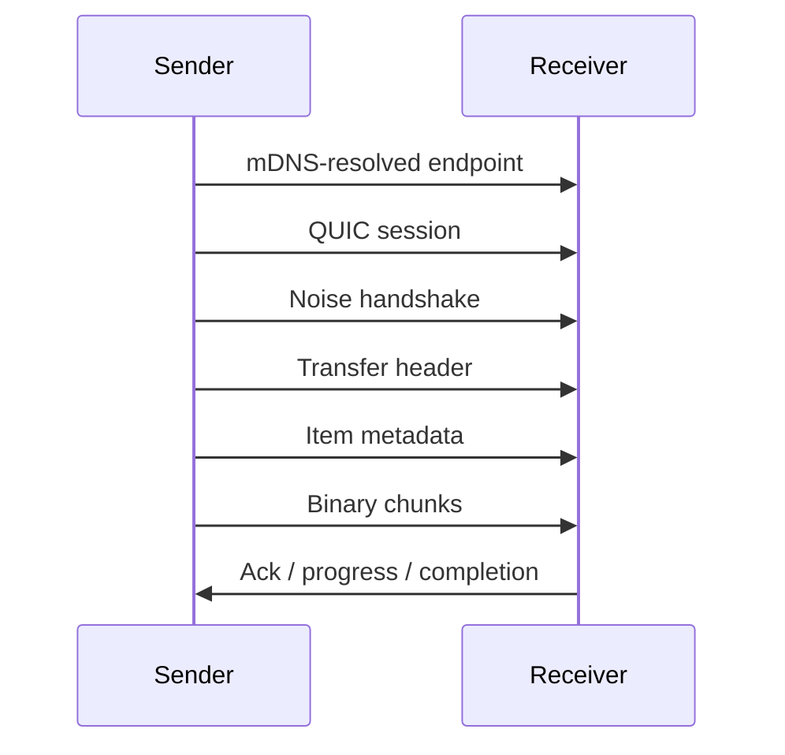

# Protocol

## Goals

The protocol must stay:

- simple to inspect during development
- efficient enough for large file transfer
- versionable
- transport-aware but not UI-coupled

## LAN Discovery

Use **mDNS** as the official LAN discovery mechanism.

Discovery data must expose at least:

- protocol version
- device id
- display name
- host name
- platform
- advertised transport endpoint
- optional capability flags

Do not rely on display name as identity. Use a stable device id.

## Transfer Framing

Prefer a framed, versioned transfer protocol over the encrypted session:

```text
[4 bytes: packet_size]
[1 byte: packet_type]
[N bytes: payload]
```

Base packet types:

- `success`
- `error`
- `metadata`
- `binary`

## Transfer Lifecycle

The transfer flow should remain explicit:

1. peer discovery
2. QUIC session setup
3. Noise handshake
4. transfer header
5. per-item metadata
6. binary chunks
7. completion or error



Each transfer should have:

- `transfer_id`
- sender device id
- receiver device id
- item count
- total bytes
- current status
- trust / acceptance state

## Trust and Acceptance

- Every incoming transfer must be explicitly accepted or rejected in the MVP unless a future trusted-device rule says otherwise.
- Fingerprint or equivalent trust material must be available to the UI.
- Trust information is part of session setup, not an afterthought.

## Metadata Rules

Metadata may be binary or JSON-backed internally, but must remain easy to evolve and inspect during development.

Recommended item metadata:

- `item_id`
- `kind` (`file`, `directory`, later `text`, `clipboard`, `screenshot`)
- `name`
- `relative_path`
- `size_bytes`
- `modified_at`
- optional mime/content hints

Directory handling rules:

- preserve relative structure
- support empty directories
- reject path traversal
- sanitize invalid names per platform

## Error Model

- Errors should be structured, not raw strings only
- Include a stable error code plus a human-readable message
- Separate protocol errors from local OS/filesystem errors
- Distinguish handshake failure, transport failure, receiver rejection, and filesystem conflict

## Versioning

- Include protocol version in discovery advertisement and transfer handshake
- Backward compatibility is not required until a released version exists
- Keep room for future transport abstraction without coupling the UI to packet details

## Security Direction

- The LAN MVP is **encrypted by default** via Noise handshake over QUIC session setup
- Do not introduce an unencrypted LAN mode unless the product decision changes explicitly
- Keep trust, pairing, and encryption concerns separate from payload framing

## Observability

- Log discovery, session setup, handshake, transfer lifecycle, and termination at useful dev levels
- Never log file contents or sensitive clipboard payloads
- Logs should make it easy to diagnose discovery failures, connection failures, handshake failures, and stalled transfers
