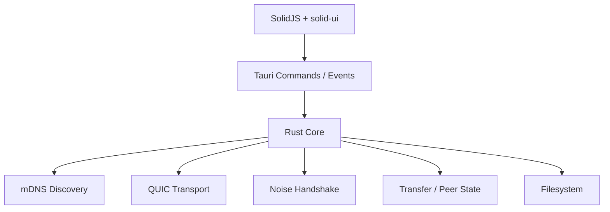
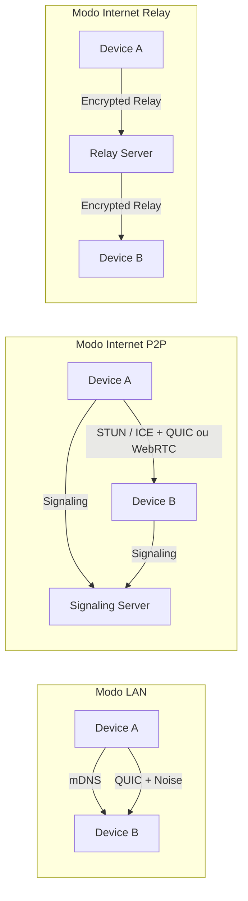
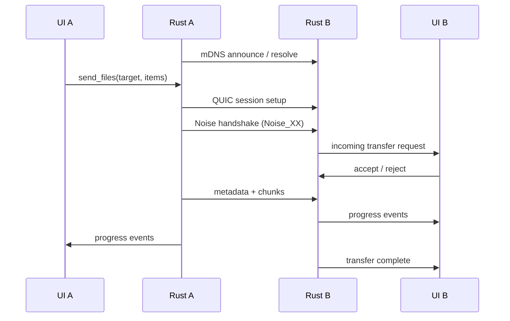
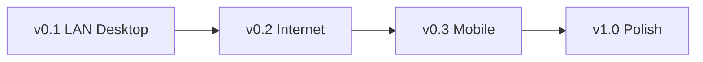

# PRD — App de Transferencia de Arquivos Multiplataforma

- **Nome:** Dukto
- **Autor:** Djalma Jr
- **Data:** Marco 2026
- **Status:** Draft v2.1

---

## 1. Visao Geral

Aplicativo multiplataforma de transferencia de arquivos que funciona tanto em rede local (LAN) quanto pela internet, com foco em simplicidade extrema e zero configuracao. O produto ocupa o espaco deixado por ferramentas descontinuadas como Dukto e NitroShare, resolvendo a principal limitacao de ambos: a ausencia de transferencia via internet.

Projeto independente, de uso pessoal, open-source.

### 1.1 Problema

Transferir arquivos entre dispositivos diferentes ainda e uma experiencia fragmentada:

- **Dukto / NitroShare** — mortos, sem manutencao desde 2017-2019
- **LocalSend** — bom em LAN, sem opcao de internet
- **KDE Connect / GSConnect** — atrelado ao ecossistema KDE/GNOME
- **Snapdrop / Pairdrop** — browser-based, limitado para arquivos grandes e UX menos robusta
- **croc** — excelente tecnicamente, mas CLI-only
- **LANDrop** — pouca tracao, sem internet
- **AirDrop / Nearby Share** — exclusivos de ecossistema

Nenhuma solucao atual combina LAN + internet, multiplataforma real, UX simples, sem cadastro e com criptografia E2E.

### 1.2 Proposta de Valor

> Abriu o app, viu os dispositivos, arrastou o arquivo. Funciona na mesma rede ou do outro lado do mundo. Sem conta, sem login, sem complicacao.

### 1.3 Publico-Alvo

- **Primario:** uso pessoal — transferencia entre dispositivos proprios (celular <-> PC, notebook <-> desktop)
- **Secundario:** usuarios tecnicos que valorizam P2P, privacidade e ferramentas open-source
- **Terciario:** qualquer pessoa que precise enviar arquivos sem depender de cloud ou cadastro

---

## 2. Objetivos e Metricas

### 2.1 Objetivos do Produto

| Objetivo | Descricao |
| --- | --- |
| **Zero-config na LAN** | Dispositivos na mesma rede se descobrem automaticamente em menos de 3 segundos |
| **Internet sem cadastro** | Transferencia remota via codigo curto ou QR code, sem criar conta |
| **Multiplataforma** | Windows, macOS, Linux, Android, iOS |
| **Criptografia E2E** | Toda transferencia e criptografada, inclusive em LAN |
| **Performance** | Saturar o link disponivel, com throughput proximo ao limite da rede |
| **Arquitetura limpa** | Uma stack principal, sem sidecar nem bridges desnecessarias |

### 2.2 Metricas de Sucesso

| Metrica | Meta (6 meses) |
| --- | --- |
| GitHub Stars | 1.000+ |
| Taxa de sucesso de transferencia | > 98% |
| Tempo para primeira transferencia | < 30 segundos apos instalar |
| Throughput LAN (gigabit) | > 800 Mbps |

Observacao: throughput, memoria e tamanho de binario sao metas importantes, mas nao bloqueiam o primeiro release se a experiencia principal estiver correta e estavel.

---

## 3. Stack Tecnica

### 3.1 Principio Arquitetural

**Uma stack, sem camadas extras.** O app e `Tauri v2 + Rust + SolidJS`. O Rust e o backend inteiro: networking, criptografia, concorrencia, protocolo, filesystem e estado de runtime. O frontend e uma camada fina de apresentacao e interacao.

### 3.2 Core — Rust

| Componente | Crate | Justificativa |
| --- | --- | --- |
| Async runtime | `tokio` | Runtime async maduro, eficiente e padrao do ecossistema |
| Transporte LAN / relay | `quinn` | Implementacao QUIC robusta, com boa base para evolucao futura |
| Descoberta LAN | `mdns-sd` | mDNS/DNS-SD para zero-config discovery |
| P2P / NAT traversal | `webrtc-rs` | Stack WebRTC em Rust para conexoes internet |
| Criptografia E2E | `snow` | Noise Protocol Framework, leve e adequado ao trust model do produto |
| Compressao | `zstd` | Compressao em stream rapida, opcional por sessao/arquivo |
| Serializacao | `serde` + `bincode` ou `prost` | Estruturas de protocolo tipadas e versionaveis |
| Filesystem | `tokio::fs` | I/O async para envio/recebimento |
| Logging / tracing | `tracing` | Structured logging e observabilidade |

### 3.3 Frontend — Tauri v2 + SolidJS

| Componente | Tecnologia | Justificativa |
| --- | --- | --- |
| Shell | Tauri v2 | Webview nativa, binario pequeno, suporte desktop e futuro mobile |
| UI framework | SolidJS | Leve, reativo, alinhado com o ecossistema ja usado pelo autor |
| Componentes | solid-ui + custom components | Acelera consistencia visual e reduz custo de implementacao |
| Styling | Tailwind CSS v4 | Velocidade de implementacao e design tokens simples |
| Comunicacao UI <-> Core | Tauri Commands / Events | IPC nativo, sem sidecar nem bridge extra |

**Decisao registrada:** o PRD originalmente mencionava Svelte, mas a implementacao oficial sera em **SolidJS + solid-ui**.

### 3.4 Infraestrutura — Modo Internet

| Componente | Tecnologia | Nota |
| --- | --- | --- |
| STUN | Servidor publico ou self-hosted | Para NAT traversal |
| Signaling | Rust (`axum` + WebSocket) | Troca de ofertas, candidatos e metadados de sessao |
| Relay fallback | Servidor relay em Rust | Quando P2P falhar |
| Hosting | VPS commodity ou Fly.io | Baixo custo e latencia razoavel |

---

## 4. Arquitetura

### 4.1 Modos de Operacao

### 4.2 Fluxo — LAN

### 4.3 Fluxo — Internet

1. Dispositivo A gera codigo curto ou QR code
2. Dispositivo B entra com o codigo ou escaneia o QR
3. Signaling server media troca de informacoes de conexao
4. App tenta conexao direta P2P
5. Se P2P falhar, usa relay automaticamente
6. O canal continua com criptografia de ponta a ponta
7. Transferencia ocorre com a mesma semantica de sessao usada na LAN

### 4.4 Comunicacao UI <-> Core

- A UI nunca implementa networking
- A UI chama `invoke()` para iniciar acoes
- O Rust emite eventos para peers, progresso, erros, trust e estados de sessao
- O estado de runtime vive no Rust; o frontend consome uma projecao desse estado

### 4.5 Trust Model

Toda transferencia precisa de um modelo claro de confianca e recebimento:

- cada dispositivo possui `device_id` estavel
- cada dispositivo exibe `display_name`, hostname e fingerprint curta
- o receiver pode **aceitar** ou **rejeitar** incoming transfers
- dispositivos confiaveis poderao existir no futuro, mas nao fazem parte do v0.1
- nomes de dispositivos nunca sao tratados como identidade unica

### 4.6 Regras Operacionais do Receiver

O receiver precisa lidar com:

- escolha de pasta destino padrao
- rename / overwrite / skip em conflitos
- preservacao de estrutura relativa de pastas
- suporte a diretorios vazios
- bloqueio de `path traversal`
- normalizacao de nomes invalidos por plataforma

---

## 5. Funcionalidades

### 5.1 MVP (v0.1) — LAN Desktop

O MVP precisa provar a tese principal do produto: descoberta zero-config + transferencia segura e simples na LAN.

| Feature | Descricao | Prioridade |
| --- | --- | --- |
| Descoberta automatica | Dispositivos na LAN via mDNS, listados em tempo real | P0 |
| Transferencia de arquivos | Envio de um ou multiplos arquivos | P0 |
| Transferencia de pastas | Diretorios inteiros, preservando estrutura | P0 |
| Drag and drop | Arrastar arquivos para a janela ou para um device | P0 |
| Progresso | Barra de progresso, velocidade e tempo restante | P0 |
| Criptografia E2E | Noise Protocol (Noise_XX) em todas as transferencias | P0 |
| Aceitar / rejeitar | Receiver aprova ou recusa transferencias recebidas | P0 |
| Pasta destino configuravel | Escolher onde salvar arquivos recebidos | P1 |
| Notificacao de recebimento | Notificacao nativa do sistema | P1 |
| Tema claro/escuro | Seguir preferencia do sistema | P2 |
| Envio de texto/clipboard | Fora do P0; entra apenas se o core LAN estiver estavel | P2 |

**Plataformas do v0.1:** Windows, macOS, Linux

### 5.2 Fora de Escopo do v0.1

- internet/P2P completo
- relay server
- QR code
- historico persistente
- screenshot send
- clipboard sync em tempo real
- favoritos, auto-accept, grupos, modo headless/CLI

### 5.3 v0.2 — Internet

| Feature | Descricao | Prioridade |
| --- | --- | --- |
| Codigo de pareamento | Codigo curto para conexao remota | P0 |
| QR code | Alternativa visual ao codigo | P0 |
| NAT traversal P2P | STUN/ICE + WebRTC ou transporte equivalente | P0 |
| Relay fallback | Servidor relay automatico quando P2P falhar | P0 |
| Transferencia resumivel | Retomar transferencia interrompida | P1 |
| Historico | Log de transferencias recentes | P2 |

### 5.4 v0.3 — Mobile

| Feature | Descricao | Prioridade |
| --- | --- | --- |
| Android | App via Tauri v2 mobile, se maturidade permitir | P0 |
| iOS | App via Tauri v2 mobile, se maturidade permitir | P0 |
| Share sheet integration | Compartilhar de qualquer app | P0 |
| Background receive | Receber arquivos em background | P1 |
| Galeria/fotos | Enviar da galeria diretamente | P1 |

**Nota:** se Tauri mobile nao estiver estavel, o protocolo deve continuar reutilizavel por um app mobile nativo separado.

---

## 6. Requisitos Nao-Funcionais

### 6.1 Performance

| Requisito | Meta |
| --- | --- |
| Descoberta LAN | < 3 segundos |
| Throughput LAN (gigabit) | > 800 Mbps |
| Throughput Internet P2P | limitado pela banda do usuario |
| Overhead de criptografia | < 5% |
| Uso de memoria idle | < 30 MB |
| Tamanho do binario desktop | < 15 MB |

### 6.2 Seguranca

| Requisito | Detalhe |
| --- | --- |
| Criptografia | E2E via Noise Protocol (Noise_XX) em todas as transferencias |
| Autenticacao visual | Fingerprint curta ou identidade visual minima do device |
| Servidor stateless | Signaling e relay nao retem conteudo de usuario |
| Validacao de paths | Sem path traversal; sanitize por plataforma |
| Codigo aberto | Protocolo e app auditaveis |

### 6.3 UX

| Requisito | Detalhe |
| --- | --- |
| Zero-config | Funcionar sem configuracao manual na LAN |
| Zero-login | Sem criacao de conta |
| Primeira transferencia | < 30 segundos apos abrir o app |
| Acessibilidade | Navegacao por teclado, contraste e labels claros |
| Clareza de erro | Falhas precisam ser entendiveis sem termos tecnicos desnecessarios |

---

## 7. Analise de Concorrencia

| App | LAN | Internet | Plataformas | Criptografia | Status |
| --- | --- | --- | --- | --- | --- |
| **Dukto** | Sim | Nao | Win/Mac/Linux/Android | Nao | Morto |
| **NitroShare** | Sim | Nao | Win/Mac/Linux | Nao | Morto |
| **LocalSend** | Sim | Nao | Todas | TLS | Ativo |
| **croc** | Sim | Sim | Todas (CLI) | PAKE | Ativo |
| **Snapdrop/Pairdrop** | Sim | Parcial | Browser | WebRTC | Ativo |
| **KDE Connect** | Sim | Nao | Linux/Android | TLS | Ativo |
| **AirDrop** | Sim | Nao | Apple only | Sim | Ativo |
| **Este projeto** | **Sim** | **Sim** | **Todas** | **Noise E2E** | Planejado |

**Diferencial:** unir LAN + internet com UX simples, multiplataforma, sem cadastro e com E2E, sem cair em browser-only ou CLI-only.

---

## 8. Referencias Tecnicas

| Referencia | Relevancia |
| --- | --- |
| `schollz/croc` | Pareamento por codigo, relay e boas ideias para modo internet |
| `localsend/localsend` | UX de descoberta LAN e fluxo de envio simples |
| `quinn-rs/quinn` | Implementacao QUIC em Rust |
| `webrtc-rs/webrtc` | Stack WebRTC em Rust |
| `mcginty/snow` | Noise Protocol em Rust |
| `keepsimple1/mdns-sd` | mDNS/DNS-SD em Rust |
| `~/Developer/github/dukto-qt5` | Referencia de UX e fluxo LAN classico |
| `~/Developer/github/nitroshare-desktop` | Referencia de modelagem de protocolo e discovery |

---

## 9. Riscos e Mitigacoes

| Risco | Impacto | Prob. | Mitigacao |
| --- | --- | --- | --- |
| Complexidade de `mDNS + QUIC + Noise` no v0.1 | Atraso no MVP | Media | Trabalhar em fatias verticais e validar 1 transferencia real cedo |
| NAT traversal falha em redes corporativas | Internet P2P nao funciona | Media | Relay como fallback automatico |
| Tauri v2 mobile imaturo | Bugs em Android/iOS | Alta | Manter mobile fora do v0.1 e reavaliar no v0.3 |
| UX de trust/fingerprint confusa | Usuario nao entende o que esta aceitando | Media | Modelar accept/reject e identidade visual do device desde cedo |
| Projeto solo — risco de abandono | Produto morre | Media | Open-source, documentacao forte, escopo controlado |

---

## 10. Roadmap

### 10.1 Visao por Fase

### 10.2 Roadmap Detalhado

#### Q2 2026 — v0.1 LAN Desktop

- Tauri v2 + SolidJS + solid-ui
- Core Rust com `mDNS + QUIC + Noise`
- Identidade de device e trust model minimo
- Transferencia de arquivo e pasta na LAN
- Drag and drop, progresso, notificacoes
- Windows, macOS, Linux

#### Q3 2026 — v0.2 Internet

- Signaling server em Rust
- P2P via STUN/ICE
- Relay fallback
- Pareamento por codigo/QR
- Transferencia resumivel

#### Q4 2026 — v0.3 Mobile

- Reavaliar maturidade de Tauri mobile
- Android + iOS se estavel
- Share sheet integration

#### Q1 2027 — v1.0 Polish

- Transferencia em grupo
- Favoritos
- Auto-accept para trusted devices
- Headless / CLI
- Performance tuning

---

## 11. Decisoes Tecnicas Registradas

### 11.1 Por que Tauri + Rust?

| Alternativa | Por que nao |
| --- | --- |
| **Go sidecar + Tauri** | Sidecar e IPC extra adicionam complexidade desnecessaria |
| **Flutter (Dart puro)** | Ecossistema menos natural para QUIC + Noise + WebRTC baixo nivel |
| **Flutter + Rust** | Funciona, mas adiciona uma bridge que Tauri ja evita |
| **Electron** | Binario e memoria muito maiores para a proposta do app |

### 11.2 Por que SolidJS + solid-ui?

- o autor ja possui referencia e familiaridade no ecossistema Solid
- solid-ui acelera implementacao de componentes consistentes
- mantem a UI leve, declarativa e alinhada com Tauri

### 11.3 Por que `mDNS + QUIC + Noise` ja no v0.1?

- alinha o MVP com o diferencial central do produto
- evita reescrever discovery, transporte e seguranca logo apos a primeira entrega
- faz sentido dado o uso intensivo de IA na implementacao, reduzindo custo de exploracao tecnica

### 11.4 Ordem de implementacao recomendada

1. scaffold do app
2. identidade do device e eventos base
3. mDNS discovery
4. sessao segura com QUIC + Noise
5. single-file transfer
6. multi-file e folder transfer
7. polish de UX e tratamento de erros
8. so depois internet/P2P

---

## Apendice A — Glossario

| Termo | Definicao |
| --- | --- |
| **mDNS** | Multicast DNS — descoberta de servicos em rede local sem servidor central |
| **QUIC** | Protocolo de transporte sobre UDP com multiplexing e criptografia nativa |
| **quinn** | Implementacao QUIC em Rust |
| **WebRTC** | Framework P2P com NAT traversal |
| **STUN** | Ajuda o peer a descobrir seu IP publico |
| **TURN / Relay** | Repassa trafego quando conexao direta falha |
| **Noise Protocol** | Framework criptografico leve para autenticacao e canal seguro |
| **snow** | Implementacao do Noise em Rust |
| **Tauri Command** | JS chama funcao Rust diretamente |
| **Tauri Event** | Rust emite, frontend escuta |
