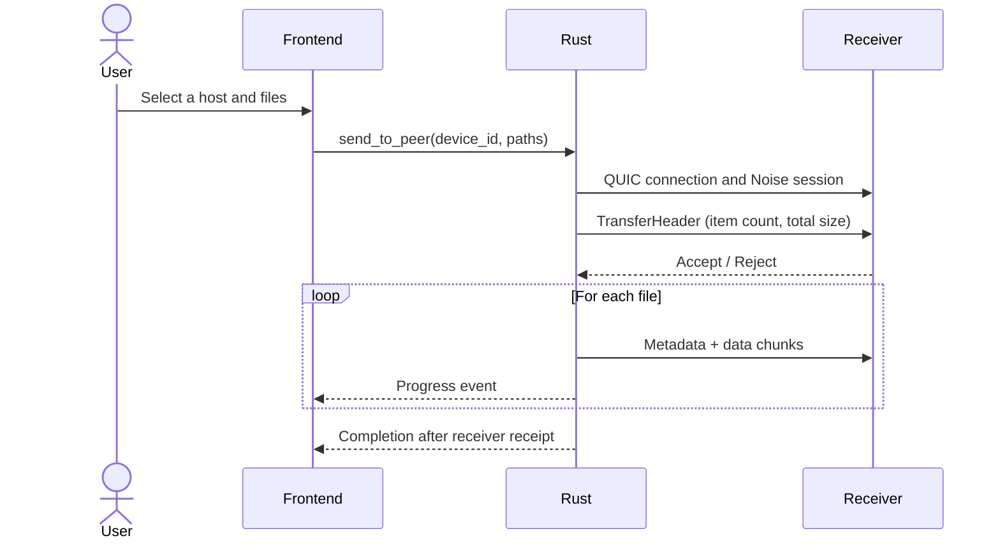
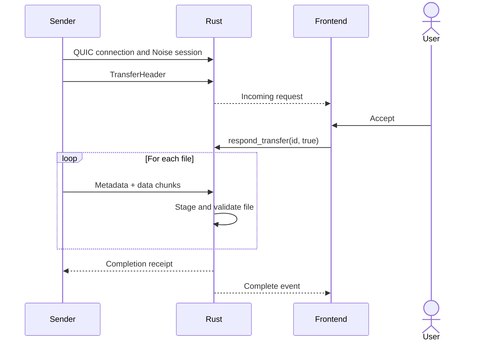

# Overview

Dukto transfers files between devices on the same local network. There is no account or cloud transfer service: run it on two devices and let local discovery find the receiver.

## How It Works

On startup, the app advertises itself through mDNS and listens for peers. Nearby devices appear in the host list. Choose a host and select files or folders to send. The receiver reviews the sender and items, then accepts or rejects the request. Accepted files are sent directly over an encrypted QUIC connection, with progress reported in both directions.

## Architecture

The application has two layers connected by Tauri:

- **Frontend** — SolidJS presentation for hosts, transfers, and settings. It communicates with the backend through commands and events.
- **Rust backend** — owns networking, discovery, transfer state, filesystem access, and settings persistence.

The CLI uses the same Rust transfer implementation as the application. It can discover devices, receive with an interactive approval prompt, or explicitly accept transfers for a scripted run.

## Why These Choices

**Why mDNS?** It allows devices to find each other on a local network without a server or manual configuration. Multicast must be available on the network.

**Why QUIC?** QUIC runs over UDP and provides reliable streams, multiplexing, and encrypted transport through TLS 1.3.

**Why Noise with QUIC?** Dukto establishes a Noise session for application data in addition to QUIC's TLS transport. Session encryption does not verify a peer's real-world identity; review each incoming request and its sender details.

**Why SolidJS?** Fine-grained reactivity keeps updates such as transfer progress focused on the UI elements that changed.

## Transfer Flow

### Sending

### Receiving

## Key Behavior

- Each incoming transfer requires explicit approval unless the CLI is run with `--accept`.
- A transfer request covers all of its listed items, but each received file is published only after that file is complete.
- Received paths are validated and names are adjusted for cross-platform compatibility.
- If a transfer is canceled or interrupted, incomplete staged data is removed. Files already completed remain available.
- The receiver times out an unanswered request after 60 seconds.
