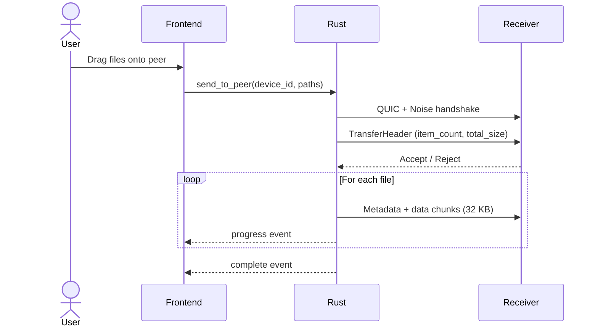
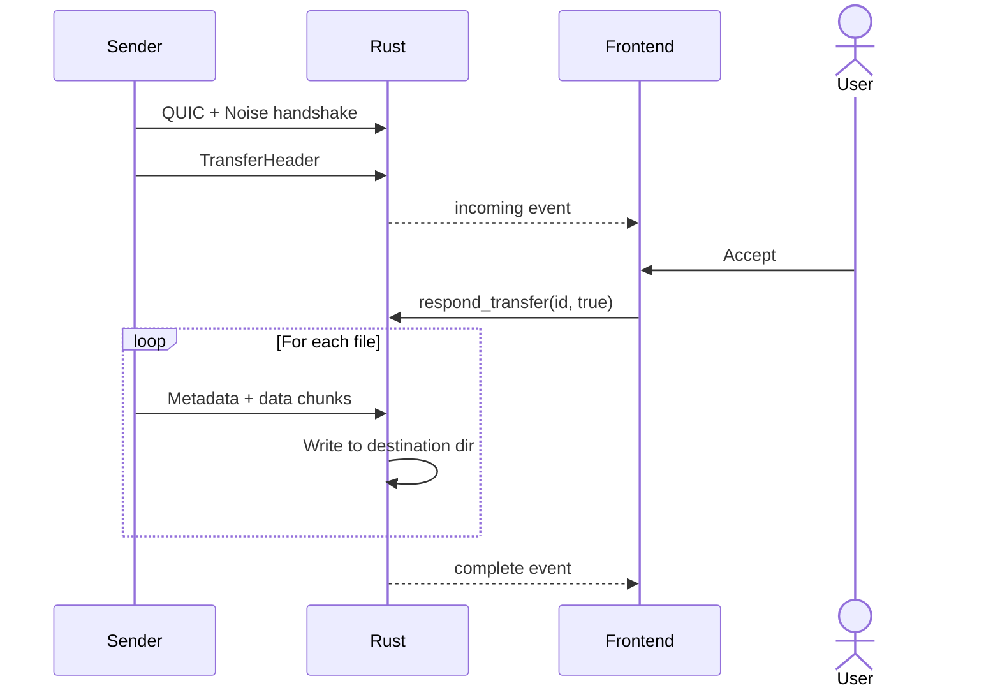

# Overview

Dukto transfers files between devices on the same local network. No server, no accounts, no configuration — run it on two machines and they find each other.

## How It Works

On startup, the app advertises itself via mDNS and starts listening for peers. Other devices appear in the UI within seconds. The user drags files onto a peer or picks them via dialog. The receiver gets a dialog to accept or reject. If accepted, files stream over QUIC with Noise encryption, with real-time progress tracking.

## Architecture

The app has two layers connected by Tauri:

- **Frontend** — pure presentation in SolidJS. Renders peers, transfers, settings. Contains zero networking, zero filesystem access, zero crypto. Communicates with Rust exclusively through commands (request/response) and events (push from Rust).

- **Rust backend** — owns all side effects. mDNS discovery, QUIC connections, Noise handshakes, file reading/writing, settings persistence.

The separation is strict: the frontend doesn't even resolve file metadata on its own — it sends paths to Rust and gets back names, sizes, and types.

## Why These Choices

**Why mDNS?** Zero configuration. Devices find each other automatically on the local network without any server. The trade-off is it only works where multicast is available (most home/office networks).

**Why QUIC over TCP?** Built-in encryption (TLS 1.3), multiplexing, faster connection establishment, no head-of-line blocking. Runs over UDP.

**Why Noise on top of QUIC?** Both sides use self-signed certificates (no CA for LAN apps), so we skip TLS certificate verification intentionally. Noise_XX provides mutual authentication with ephemeral keys per session — no certificate management needed.

**Why SolidJS?** Fine-grained reactivity. Peer status, transfer progress, and theme changes update exactly the DOM nodes that changed. No virtual DOM diffing.

**Why TanStack Router?** File-based routing with colocated components. Currently one route, but the convention scales when the app grows.

## Transfer Flow

### Sending

### Receiving

## Key Decisions

**Every transfer requires explicit acceptance.** No auto-accept, no trusted device list. The receiver always decides. File transfer tools that silently accept are a security risk.

**Device identity is a UUID, not a display name.** The display name comes from the OS and can change. The UUID is generated once and persisted. This matters for future trusted device management — you trust a device_id, not a name.

**Path validation is aggressive.** Received files go through traversal checks, name sanitization (Windows reserved names, control characters), and conflict resolution ("file (1)", "file (2)" etc.). A malicious sender cannot write outside the destination directory.

**Transfers are atomic per batch.** Accept or reject the entire transfer, not individual files. The sender sends a header with item count and total size upfront.

**60-second acceptance timeout.** If the receiver doesn't respond, the transfer is automatically rejected. Prevents connections from hanging.

**32 KB chunk size.** Chosen to fit within the Noise protocol's max message size (65535 bytes) with room for encryption overhead. Each chunk is individually encrypted.
