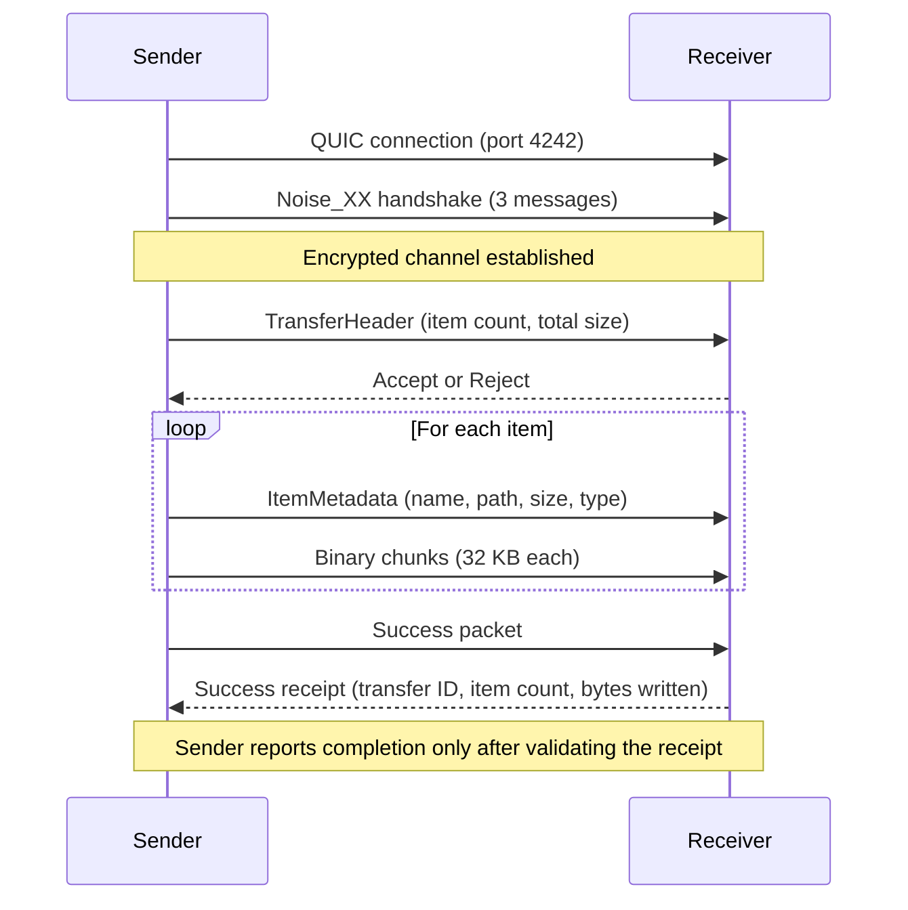

# Transfer Protocol

Files move over QUIC with Noise encryption. The protocol is framed, sequential, and requires explicit acceptance before any file data flows.

## Connection Lifecycle



### Why This Order Matters

The Noise handshake happens **before** any application data. This means the receiver doesn't even know who's sending until after encryption is established. The TransferHeader is the first application-level message, and it's already encrypted.

The Accept/Reject step happens **after** the receiver sees the header (who's sending, how many items, total size) but **before** any file content flows. This gives the receiver enough information to make a decision without wasting bandwidth.

## Packet Framing

Every message on the wire follows this format:

```
[4 bytes: length (little-endian u32)]
[1 byte:  packet type]
[N bytes: payload]
```

The length prefix includes the type byte + payload. The payload is JSON for metadata packets and raw bytes for file data. Everything is encrypted at the Noise layer before framing.

## How Files Are Sent

The sender walks all input paths (files and directories) into a flat list before the transfer begins. Directories are expanded recursively — the receiver gets individual files with relative paths that preserve the folder structure.

For each item:
1. Send an ItemMetadata packet with the file name, relative path, size, and whether it's a file or directory
2. If it's a file, send the content in 32 KB Binary packets until all bytes are sent
3. If it's a directory (empty ones only — non-empty directories are represented by their file children), send metadata only

The 32 KB chunk size was chosen to fit within Noise's max message size (65535 bytes) with room for encryption overhead.

## Why QUIC Uses Self-Signed Certificates

Both sides generate ephemeral self-signed TLS certificates. The QUIC client accepts these certificates; Noise_XX then encrypts the application session. The current implementation generates ephemeral Noise keys and does not persist or verify a trusted peer key, so this does not authenticate a person's identity or prevent an active intermediary by itself. User and host names are sender-provided labels, not verified credentials. Persistent trusted-device pairing is not implemented.

## Sender Identity

Protocol 0.2 headers retain `sender_device_id` and can include an optional `sender` object with `device_id`, `display_name`, `hostname` and `platform`. The receiver rejects a supplied identity whose device ID differs from `sender_device_id`. Older 0.2 headers without the object remain accepted; older receivers ignore the additional JSON field.

This lets direct-address CLI senders identify themselves without announcing an mDNS service. The desktop shows `user@host` in the approval modal and a transfer-bound card for an undiscovered sender. That card does not advertise a send endpoint or allow file selection; it disappears when its transfers are dismissed. Identity travels inside the encrypted header but remains self-reported.

## Path Safety

Received file paths go through multiple validation steps:

- **No path traversal** — relative paths containing `..` are rejected
- **No absolute paths** — paths starting with `/` or `\` are rejected
- **No null bytes** — prevents null byte injection attacks
- **Name sanitization** — characters invalid on any platform (`< > : " | ? *`, control chars) are replaced with `_`. Windows reserved names (CON, PRN, AUX, NUL, COM1-9, LPT1-9) are prefixed with `_`
- **Conflict resolution** — if a file already exists at the destination, the app appends " (1)", " (2)", etc. up to 999, then falls back to a UUID suffix

These checks reject unsafe path syntax and reserve new file names without overwriting an existing file. They do not establish trust in the sender.

## Error Handling

Errors can occur at multiple stages:

- **Handshake failure** — Noise negotiation fails (incompatible versions, network issue). Connection closes immediately.
- **Rejection** — receiver sends AcceptReject with `accepted: false`. Sender gets an error, connection closes cleanly.
- **Transport failure** — QUIC connection drops mid-transfer. Sender detects the stream close and emits an error event.
- **Filesystem error** — receiver can't write to the destination. Transfer fails with a structured error.

All errors are surfaced to the frontend via events with the transfer_id, so the UI can show the error on the correct peer card.

## Acceptance Timeout

When the receiver gets a TransferHeader, the server creates a pending entry and waits for the frontend to call `respond_transfer`. If no response comes within 60 seconds, the transfer is automatically rejected. This prevents abandoned connections from holding resources.

## Progress Tracking

Protocol 0.2 adds a receiver receipt after file writes are flushed and advertised
item/byte counts match. A sender must validate this receipt before closing QUIC
or reporting success. CLI and desktop use this same pipeline; update both builds
together when upgrading from 0.1. Progress reaching 100% only means all bytes
have been queued locally, not that the receiver has confirmed completion.

The sender emits a progress event after every 32 KB chunk. The event includes bytes_sent, bytes_total, speed_bps (calculated from elapsed time since transfer start), and percent. The frontend uses these to render progress bars and speed indicators on the peer card.

Both directions report throughput as cumulative transferred bytes divided by elapsed seconds, independently for each session. Receive timing begins after acceptance.
