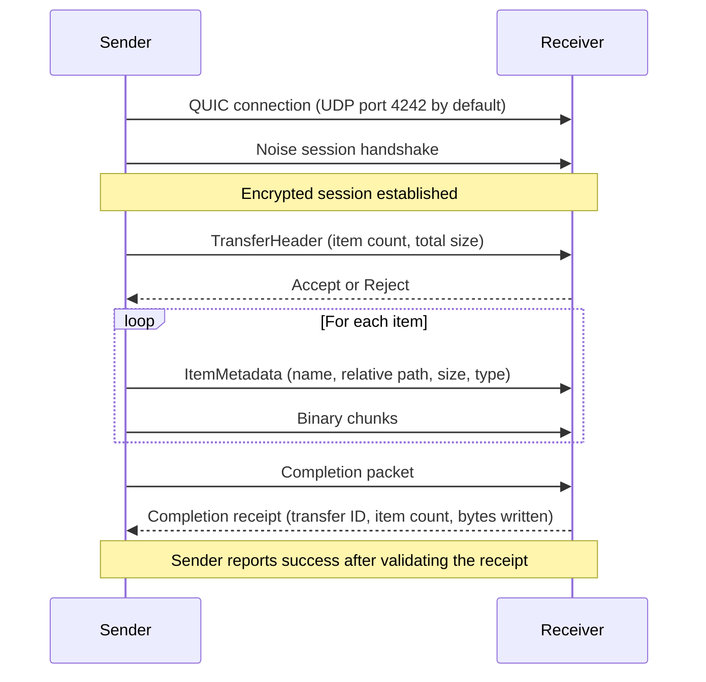

# Transfer Protocol

Dukto sends file data over QUIC and establishes a Noise session before application messages are exchanged. The protocol is sequential per transfer and requires receiver approval before file data flows.

## Connection Lifecycle

The receiver first shows the sender and transfer summary, then asks for approval. File data is sent only after approval. The receiver publishes each file only after its full contents have arrived.

## Packet Framing

Application messages use a four-byte little-endian length prefix, followed by a one-byte packet type and its payload. Metadata is encoded as JSON; file chunks contain raw bytes. Messages are encrypted within the Noise session.

## Sending Files

The sender expands input folders into files with relative paths that preserve the directory structure. Empty directories are sent as metadata. Files are streamed in chunks; the receiver validates relative paths and stages each file in its destination directory.

After a staged file is completely received, the receiver flushes and syncs it, then publishes it with an atomic no-replace operation. If a name conflicts, it chooses an available numbered name. A failure or cancellation removes the incomplete staging file. Files already published from the same batch and unrelated pre-existing files remain untouched, so a multi-file transfer is not one filesystem-wide atomic operation.

## Encryption and Identity

QUIC uses TLS 1.3 for transport. Dukto also derives application-session keys with Noise. The self-signed QUIC certificates are not verified against a certificate authority, and Dukto does not persist or pin a peer's Noise key. The session is encrypted, but it does not authenticate a person's real-world identity or by itself prevent an active intermediary. Sender names, host names, and device IDs are self-reported values.

Protocol 0.2 headers can include a sender object with a device ID, display name, host name, and platform. The receiver rejects a sender object whose device ID differs from the header's `sender_device_id`. This consistency check does not prove that either value belongs to a particular person or machine.

## Path Safety

Received paths go through validation before a file is created:

- Relative paths containing `..` are rejected.
- Absolute paths are rejected.
- Names are sanitized for characters that are invalid on supported platforms.
- Existing destination paths are not replaced; a numbered conflict name is selected.

These checks reduce unsafe path writes and accidental data loss. They do not establish trust in the sender.

## Cancellation and Errors

When a sender cancels a transfer, it closes the QUIC connection with application close code `0xD0170` and reason `dukto:transfer-cancelled:v1`. The receiver recognizes this exact marker and reports a remote cancellation; an ordinary connection failure remains a connection error.

A disconnect, cancellation, protocol error, or filesystem error can stop a transfer. The receiver removes only the incomplete staged file. Files that finished earlier in the batch and files that existed before the transfer are preserved. Dukto does not resume interrupted transfers.

## Acceptance Timeout

The receiver waits up to 60 seconds for the user to accept or reject an incoming request. An unanswered request is rejected and its connection is closed.

## Progress and Completion

Protocol 0.2 uses a receipt containing the transfer ID, item count, and bytes received. The sender validates that receipt before reporting success. Progress reaching 100% means the sender has streamed the expected bytes; only a valid receiver receipt confirms completion.

Both directions report the cumulative transfer rate for the active session. Receive timing begins after the request is accepted.
