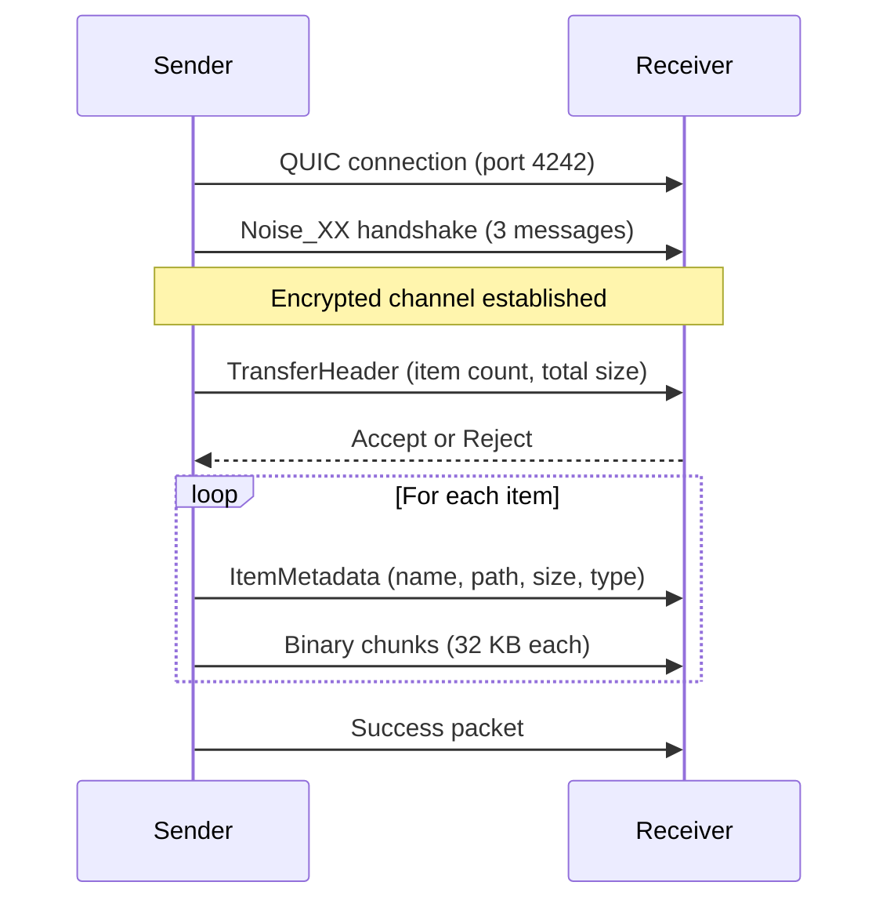

# Transfer Protocol

Files move over QUIC with Noise encryption. The protocol is framed, sequential, and requires explicit acceptance before any file data flows.

## Connection Lifecycle



### Why This Order Matters

The Noise handshake happens **before** any application data. This means the receiver doesn't even know who's sending until after encryption is established. The TransferHeader is the first application-level message, and it's already encrypted.

The Accept/Reject step happens **after** the receiver sees the header (who's sending, how many items, total size) but **before** any file content flows. This gives the receiver enough information to make a decision without wasting bandwidth.

## Packet Framing

Every message on the wire follows this format:

```
[4 bytes: length (little-endian u32)]
[1 byte:  packet type]
[N bytes: payload]
```

The length prefix includes the type byte + payload. The payload is JSON for metadata packets and raw bytes for file data. Everything is encrypted at the Noise layer before framing.

## How Files Are Sent

The sender walks all input paths (files and directories) into a flat list before the transfer begins. Directories are expanded recursively — the receiver gets individual files with relative paths that preserve the folder structure.

For each item:
1. Send an ItemMetadata packet with the file name, relative path, size, and whether it's a file or directory
2. If it's a file, send the content in 32 KB Binary packets until all bytes are sent
3. If it's a directory (empty ones only — non-empty directories are represented by their file children), send metadata only

The 32 KB chunk size was chosen to fit within Noise's max message size (65535 bytes) with room for encryption overhead.

## Why QUIC Uses Self-Signed Certificates

Both sides generate ephemeral self-signed TLS certificates. The receiver's QUIC endpoint has a `SkipServerVerification` verifier that accepts any certificate. This sounds dangerous but is safe because:

1. TLS is only the transport layer here — it provides basic encryption for the QUIC handshake
2. The actual authentication happens at the Noise layer, which does a full Noise_XX key exchange
3. Neither side has a CA to verify certificates against — these are ephemeral LAN connections
4. The Noise handshake provides stronger mutual authentication than TLS certificate pinning would

## Path Safety

Received file paths go through multiple validation steps:

- **No path traversal** — relative paths containing `..` are rejected
- **No absolute paths** — paths starting with `/` or `\` are rejected
- **No null bytes** — prevents null byte injection attacks
- **Name sanitization** — characters invalid on any platform (`< > : " | ? *`, control chars) are replaced with `_`. Windows reserved names (CON, PRN, AUX, NUL, COM1-9, LPT1-9) are prefixed with `_`
- **Conflict resolution** — if a file already exists at the destination, the app appends " (1)", " (2)", etc. up to 999, then falls back to a UUID suffix

This means a malicious sender cannot write outside the destination directory or overwrite system files.

## Error Handling

Errors can occur at multiple stages:

- **Handshake failure** — Noise negotiation fails (incompatible versions, network issue). Connection closes immediately.
- **Rejection** — receiver sends AcceptReject with `accepted: false`. Sender gets an error, connection closes cleanly.
- **Transport failure** — QUIC connection drops mid-transfer. Sender detects the stream close and emits an error event.
- **Filesystem error** — receiver can't write to the destination. Transfer fails with a structured error.

All errors are surfaced to the frontend via events with the transfer_id, so the UI can show the error on the correct peer card.

## Acceptance Timeout

When the receiver gets a TransferHeader, the server creates a pending entry and waits for the frontend to call `respond_transfer`. If no response comes within 60 seconds, the transfer is automatically rejected. This prevents abandoned connections from holding resources.

## Progress Tracking

The sender emits a progress event after every 32 KB chunk. The event includes bytes_sent, bytes_total, speed_bps (calculated from elapsed time since transfer start), and percent. The frontend uses these to render progress bars and speed indicators on the peer card.

Speed is calculated as total bytes sent divided by elapsed seconds — a simple average, not a sliding window. This is good enough for LAN transfers where speed is relatively stable.
