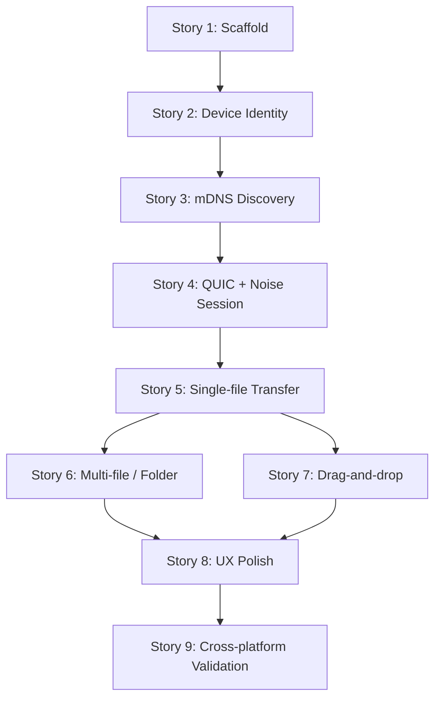

# Epic: Duto v0.1 — MVP LAN Desktop

**Origem:** `planning/mvp-lan/intake.md`

## Contexto

- **Problema macro:** nenhuma ferramenta ativa combina descoberta LAN zero-config, transferencia segura E2E, UX simples e multiplataforma desktop
- **Objetivo da iniciativa:** entregar um app desktop funcional que descobre peers na LAN, transfere arquivos/pastas com criptografia E2E e oferece UX minimalista com feedback claro
- **Resultado esperado:** o usuario abre o Duto em 2 devices na mesma rede, ve os peers, arrasta arquivo/pasta, e a transferencia acontece com progresso visivel e integridade garantida
- **Restricoes:** Tauri v2 + Rust + SolidJS + solid-ui; mDNS + QUIC + Noise; projeto solo com IA; validacao macOS + Windows/Linux (VM)

### AS-IS

- repositorio contem apenas docs, rules e plano
- nenhum codigo executavel existe
- PRD, intake e rules estao alinhados

### TO-BE

- app desktop funcional rodando em macOS + Windows/Linux
- peers aparecem automaticamente na LAN via mDNS
- transferencia de arquivo/pasta com E2E via QUIC + Noise
- drag-and-drop, progresso, accept/reject, notificacoes, pasta destino

### Fora de escopo

- internet/P2P, relay, signaling, QR code
- historico persistente, clipboard sync, screenshot send
- favoritos, auto-accept, grupos, trusted devices, headless/CLI
- CI/CD pipeline, mobile

---

## Backlog de stories

### Story 1: Scaffold do app

**Tamanho:** M | **Status:** [ ] Nao iniciada | **Depende de:** —

**Objetivo:** criar a base do projeto Tauri v2 + SolidJS + Rust com build funcional, lint, typecheck e estrutura de modulos.

**Tarefas:**
- [ ] Inicializar projeto Tauri v2 com template SolidJS
- [ ] Configurar Vite + vite-plugin-solid + Tailwind v4
- [ ] Configurar biome para lint/format
- [ ] Configurar tsconfig
- [ ] Criar estrutura de modulos Rust: commands, protocol, discovery, transfer, crypto, state, platform
- [ ] Criar scripts: dev, build, lint, test
- [ ] Validar que `tauri dev` abre a janela com hello world

**Verificacao:**
- `bun run dev` abre a janela do app
- `bun run lint` passa sem erro
- `cargo check` passa sem erro

---

### Story 2: Identidade de device e estado compartilhado

**Tamanho:** S | **Status:** [ ] Nao iniciada | **Depende de:** Story 1

**Objetivo:** cada instancia do app gera e persiste um `device_id` unico, exibe `display_name` e hostname, e o estado de runtime (peers, transfers) e centralizado em Rust com bridge para o frontend.

**Tarefas:**
- [ ] Gerar `device_id` (UUID) na primeira execucao e persistir localmente
- [ ] Coletar `display_name` (username do SO), hostname e plataforma
- [ ] Criar struct `DeviceIdentity` no Rust
- [ ] Criar modulo `state` com `AppState` centralizado (peers, transfers, settings)
- [ ] Criar Tauri command `get_device_info` que retorna identidade ao frontend
- [ ] Criar store basico no frontend que consome o device info

**Verificacao:**
- app exibe device_id, display_name e hostname na UI
- device_id persiste entre reinicializacoes
- `cargo test` valida geracao e persistencia de identidade

---

### Story 3: Descoberta LAN via mDNS

**Tamanho:** L | **Status:** [ ] Nao iniciada | **Depende de:** Story 2

**Objetivo:** o app anuncia presenca na LAN via mDNS e descobre outros peers automaticamente. Peers aparecem e desaparecem na UI em tempo real.

**Tarefas:**
- [ ] Integrar crate `mdns-sd` no modulo `discovery`
- [ ] Registrar servico mDNS na inicializacao com metadata: protocol version, device_id, display_name, hostname, platform, porta QUIC
- [ ] Implementar browse/resolve de peers na rede
- [ ] Emitir Tauri events (`peer_found`, `peer_lost`, `peer_updated`) para o frontend
- [ ] Criar store `peers` no frontend que escuta eventos e mantem lista reativa
- [ ] Criar componente `PeerList` que renderiza peers descobertos
- [ ] Implementar `goodbye` / unregister ao fechar o app
- [ ] Testar com 2 instancias na mesma rede

**Verificacao:**
- abrir 2 instancias em devices diferentes: cada uma ve a outra em < 5s
- fechar uma instancia: a outra remove o peer da lista
- `cargo test` valida registro e browse do servico mDNS

---

### Story 4: Sessao segura com QUIC + Noise

**Tamanho:** L | **Status:** [ ] Nao iniciada | **Depende de:** Story 3

**Objetivo:** ao iniciar uma transferencia, o sender estabelece sessao QUIC com o receiver e executa handshake Noise (Noise_XX) antes de trocar qualquer payload. O canal fica criptografado E2E.

**Tarefas:**
- [ ] Integrar crate `quinn` no modulo `transfer` (QUIC server + client)
- [ ] Configurar QUIC listener na porta anunciada via mDNS
- [ ] Integrar crate `snow` no modulo `crypto`
- [ ] Implementar Noise_XX handshake sobre QUIC stream (initiator + responder)
- [ ] Criar struct `TransferSession` com id, estado, device info do peer, e canal criptografado
- [ ] Emitir eventos de estado de sessao para o frontend (`session_establishing`, `session_ready`, `session_failed`)
- [ ] Testar handshake entre 2 instancias e verificar que dados passam criptografados

**Verificacao:**
- 2 instancias estabelecem sessao QUIC + Noise com sucesso
- handshake falha graciosamente se o peer nao responde
- `cargo test` valida handshake completo com mock de transporte

---

### Story 5: Transferencia de arquivo unico

**Tamanho:** L | **Status:** [ ] Nao iniciada | **Depende de:** Story 4

**Objetivo:** o sender seleciona um arquivo, o receiver recebe incoming request com metadata, aceita/rejeita, e o arquivo e transferido com progresso visivel em ambos os lados.

**Tarefas:**
- [ ] Definir protocolo de framing sobre a sessao criptografada (packet_size + packet_type + payload)
- [ ] Implementar envio: transfer header -> item metadata -> binary chunks (64-128 KB)
- [ ] Implementar recebimento: ler header, mostrar incoming request ao receiver, esperar accept/reject
- [ ] Implementar accept/reject via Tauri command no receiver
- [ ] Implementar escrita no disco com pasta destino padrao
- [ ] Emitir eventos de progresso (`transfer_progress`) com bytes enviados, velocidade e percentual
- [ ] Emitir evento de conclusao (`transfer_complete`) ou erro (`transfer_error`)
- [ ] Criar componente basico de progresso no frontend
- [ ] Criar dialog basico de incoming request no frontend
- [ ] Testar com arquivo pequeno (< 1 MB) e arquivo grande (1-2 GB)

**Verificacao:**
- arquivo pequeno transferido com integridade (hash match)
- arquivo grande transferido sem estouro de memoria
- progresso visivel em ambos os lados
- reject funciona: transferencia cancela sem erro

---

### Story 6: Multi-file e folder transfer

**Tamanho:** M | **Status:** [ ] Nao iniciada | **Depende de:** Story 5

**Objetivo:** expandir a transferencia para multiplos arquivos e pastas inteiras, preservando estrutura relativa, suportando diretorios vazios e aplicando regras de seguranca.

**Tarefas:**
- [ ] Estender protocolo: transfer header com item_count e total_size
- [ ] Enviar multiplos itens em sequencia sobre a mesma sessao
- [ ] Preservar caminho relativo de cada item dentro de uma pasta
- [ ] Suportar diretorios vazios como item de metadata (kind: directory, size: 0)
- [ ] Implementar path traversal protection (rejeitar `..` e caminhos absolutos)
- [ ] Implementar sanitize de nomes invalidos por plataforma
- [ ] Implementar politica de conflito: rename por padrao (ex: `file (1).txt`)
- [ ] Testar com pasta contendo subpastas, arquivos e dirs vazios
- [ ] Testar conflito de nomes

**Verificacao:**
- pasta com estrutura complexa chega intacta no receiver
- diretorios vazios sao criados
- nomes invalidos sao sanitizados sem erro
- path traversal e rejeitado
- conflito de nome gera rename automatico

---

### Story 7: Drag-and-drop e selecao de arquivos

**Tamanho:** M | **Status:** [ ] Nao iniciada | **Depende de:** Story 5

**Objetivo:** o usuario pode arrastar arquivos/pastas para a janela do app ou para um peer especifico, ou usar file picker para selecionar. A acao inicia a transferencia.

**Tarefas:**
- [ ] Implementar drop zone global na janela do app
- [ ] Implementar drop em peer especifico na lista de peers
- [ ] Integrar Tauri dialog para file picker como alternativa ao drag-and-drop
- [ ] Mostrar preview basico dos itens selecionados antes de enviar
- [ ] Se dropar na janela sem peer selecionado, pedir para escolher o peer
- [ ] Feedback visual de hover/drag states na drop zone e nos peers

**Verificacao:**
- drag-and-drop de arquivo funciona e inicia transferencia
- drag-and-drop de pasta funciona
- file picker funciona como alternativa
- hover states visiveis e claros

---

### Story 8: UX polish — notificacoes, pasta destino, tema e erros

**Tamanho:** M | **Status:** [ ] Nao iniciada | **Depende de:** Story 6, Story 7

**Objetivo:** fechar as features P1/P2 do MVP e garantir que erros sao tratados de forma clara e o app se comporta como cidadao de primeira classe no desktop.

**Tarefas:**
- [ ] Implementar notificacao nativa ao receber incoming transfer (tauri-plugin-notification)
- [ ] Implementar configuracao de pasta destino padrao (settings basico)
- [ ] Persistir pasta destino entre sessoes
- [ ] Implementar tema claro/escuro seguindo preferencia do sistema
- [ ] Mapear e tratar erros comuns: peer offline, handshake falhou, disco cheio, permissao negada, transferencia cancelada
- [ ] Mostrar mensagens de erro claras na UI (sem jargao tecnico)
- [ ] Implementar cancelamento de transferencia em andamento (sender ou receiver)
- [ ] Empty state quando nao ha peers na rede
- [ ] Validar acessibilidade basica: navegacao por teclado, labels, contraste

**Verificacao:**
- notificacao aparece ao receber transfer
- pasta destino persiste entre reinicializacoes
- tema acompanha o sistema
- erros comuns mostram mensagem clara
- cancelamento funciona sem crash
- app e navegavel por teclado

---

### Story 9: Validacao cross-platform

**Tamanho:** S | **Status:** [ ] Nao iniciada | **Depende de:** Story 8

**Objetivo:** validar o app rodando em macOS + Windows ou Linux (VM), com transferencia real entre as plataformas.

**Tarefas:**
- [ ] Build de producao em macOS (`tauri build`)
- [ ] Build de producao em Windows ou Linux (VM)
- [ ] Testar descoberta mDNS entre macOS e Windows/Linux
- [ ] Testar transferencia de arquivo unico entre plataformas
- [ ] Testar transferencia de pasta entre plataformas
- [ ] Validar sanitize de nomes (ex: caracteres invalidos no Windows)
- [ ] Validar tamanho do binario e uso de memoria
- [ ] Documentar bugs encontrados e corrigir bloqueadores

**Verificacao:**
- transferencia funciona entre macOS e Windows/Linux
- nenhum bug bloqueador aberto
- binario < 20 MB (meta < 15 MB, aceitavel < 20 MB)
- memoria idle < 50 MB (meta < 30 MB, aceitavel < 50 MB)

---

## Roadmap do epic

**Caminho critico:** S1 -> S2 -> S3 -> S4 -> S5 -> S6 -> S8 -> S9

**Paralelismo possivel:** Story 6 e Story 7 podem ser trabalhadas em paralelo apos Story 5.

**Marcos de validacao intermediaria:**
- apos S3: 2 instancias se veem na LAN (prova de discovery)
- apos S5: 1 arquivo transferido ponta a ponta com E2E (prova de transporte)
- apos S8: MVP funcional completo (prova de produto)

---

## Criterio de aceite do epic

- [ ] App abre com UI funcional em macOS + Windows/Linux
- [ ] Peers aparecem automaticamente na LAN via mDNS em < 5 segundos
- [ ] Sessao QUIC + Noise estabelecida com sucesso entre 2 devices
- [ ] Arquivo unico transferido com integridade e progresso visivel
- [ ] Pasta com subpastas e dirs vazios transferida com estrutura preservada
- [ ] Drag-and-drop funciona como metodo principal de envio
- [ ] Accept/reject funciona no receiver
- [ ] Notificacoes nativas aparecem ao receber transfer
- [ ] Pasta destino configuravel e persistente
- [ ] Tema claro/escuro segue o sistema
- [ ] Erros comuns exibidos de forma clara
- [ ] Transferencia cancelavel sem crash
- [ ] Funciona cross-platform: macOS <-> Windows/Linux
- [ ] PRD, rules e implementacao apontam para a mesma stack e definicao de MVP

---

## Riscos

| Risco | Mitigacao |
| --- | --- |
| mDNS se comporta diferente entre macOS e Windows/Linux | Testar discovery cross-platform cedo (marco apos S3) |
| QUIC + Noise handshake complexo de acertar | Isolar em modulo `crypto`, validar com testes unitarios antes de integrar UI |
| Transferencia de arquivo grande estoura memoria | Usar streaming de chunks, nunca carregar arquivo inteiro em memoria |
| Nomes de arquivo invalidos entre plataformas | Sanitize explicito no receiver, com testes especificos por SO |
| Tauri v2 com SolidJS pode ter gaps de documentacao | Usar skedly como referencia de padroes ja validados |
| Scope creep: querer adicionar clipboard, history, internet no meio do MVP | Manter fora de escopo explicito; so abrir apos S9 concluida |

---

## Proximo passo recomendado

Detalhar **Story 1: Scaffold do app** com `/story` ou `/plan` e iniciar a implementacao.
